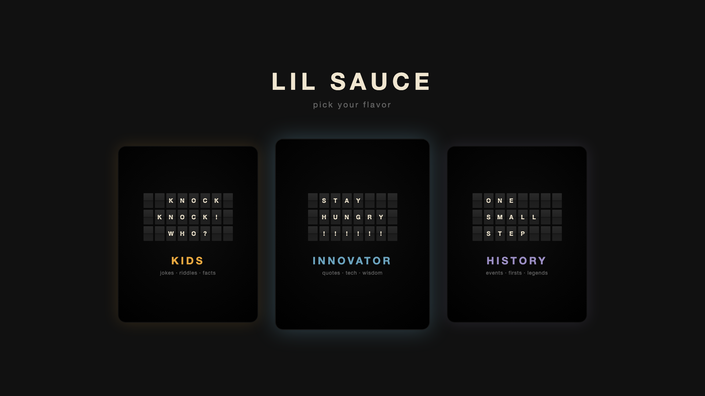
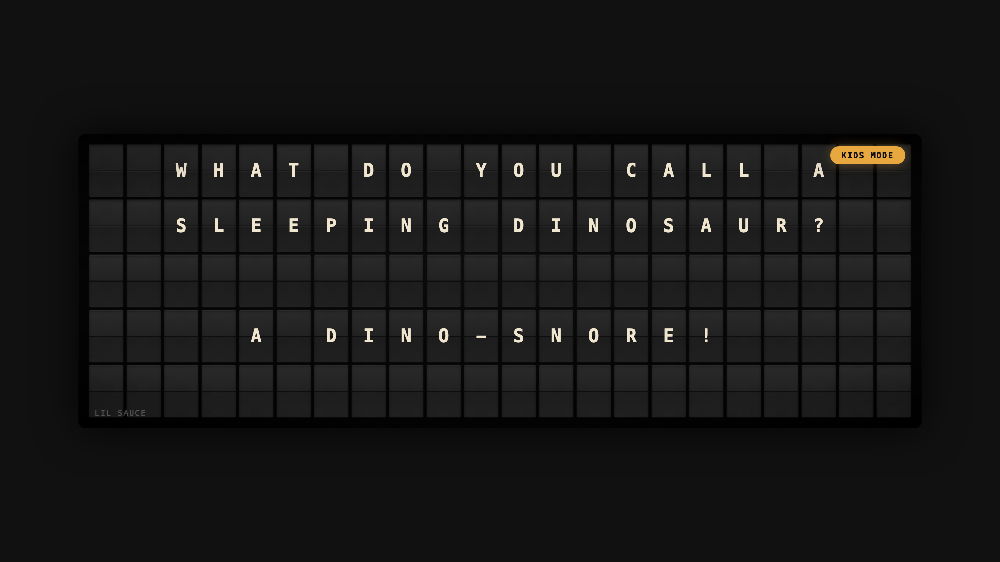
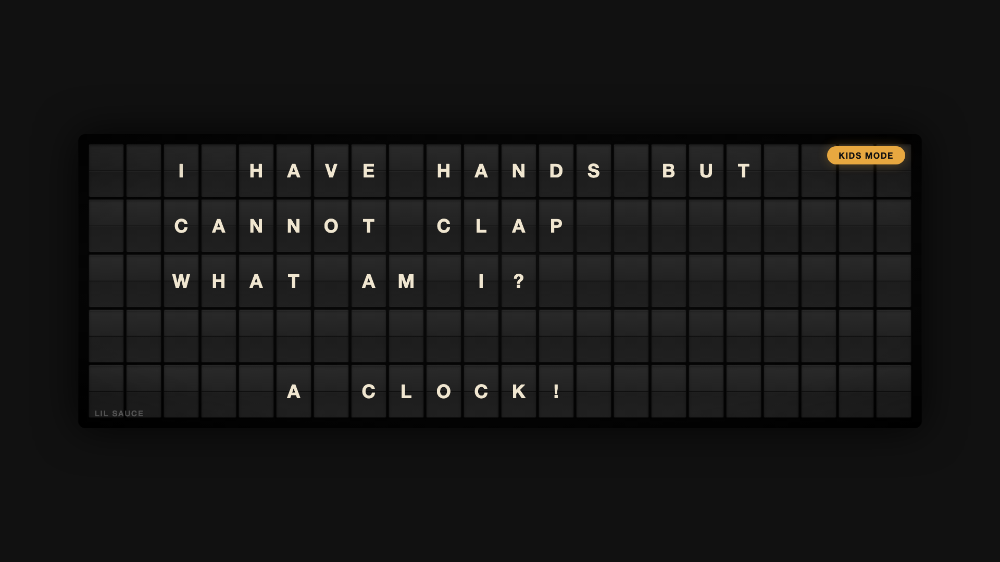
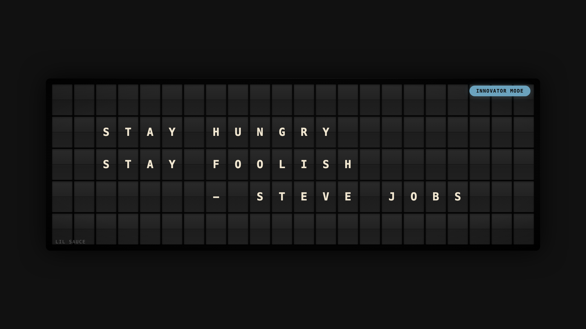

# Lil Sauce

**Turn your Apple TV into a beautiful split-flap display.**

Jokes, riddles, inventor quotes, historical facts — 1,500+ curated messages displayed on a realistic mechanical flip board with authentic click sounds.

🔴 **Try it now:** [emmabot.github.io/lilsauce](https://emmabot.github.io/lilsauce/)

---

## Three Modes

### 🎈 Kids Mode
Jokes, riddles, math challenges, and word games — all kid-friendly and parent-approved. Riddle answers reveal after a pause. Includes time-aware morning routines and bedtime wind-down messages.

### 💡 Innovator Mode
Tech history, inventor quotes, and stories from the people who built the future — Ada Lovelace, Grace Hopper, Steve Jobs, and more.

### 📜 History Mode
Historical facts, quotes from world leaders, and moments that shaped civilization — from ancient Rome to the Space Age.

---

## Features

- 🔠 **Realistic split-flap animation** — each tile flips individually with staggered timing
- 🔊 **Mechanical click sounds** — authentic flip-board audio (toggle on/off)
- 📚 **1,500+ curated messages** — no repeats, no filler
- 🎮 **Siri Remote navigation** — swipe to browse, click to select
- 🎯 **Mode selection** — switch between Kids, Innovator, and History
- 🌅 **Time-aware content** — morning routines and bedtime messages in Kids mode
- 🔒 **No accounts, no ads, no tracking**
- 📺 **Works on Apple TV and any web browser**

## How It Works

**Apple TV (Siri Remote):**
- Swipe **left/right** — previous/next message
- Press **Play/Pause** — toggle sound
- Press **Menu** — open mode picker

**Web (keyboard):**
- `←` / `→` — previous/next message
- `M` — toggle sound
- `Enter` — next message
- `F` — fullscreen

## Web Version

Open [emmabot.github.io/lilsauce](https://emmabot.github.io/lilsauce/) on any browser — TV, tablet, phone, or desktop. No install required.

## Technical

- **tvOS app** — native UIKit, built in `tvos/`
- **Web app** — vanilla HTML/CSS/JS, zero dependencies
- **Content** — JSON pipeline (`messages.json`), modes loaded at runtime
- **Hosting** — GitHub Pages, auto-deploys on push to `main`

## Privacy

No accounts. No ads. No tracking. No data collection of any kind.

[Privacy Policy](https://emmabot.github.io/lilsauce/privacy.html)

## License

MIT
